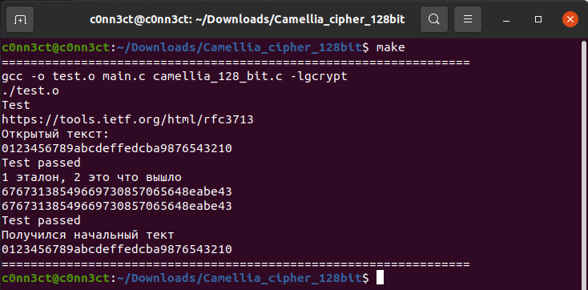

# Camellia_cipher_128bit

Тут реализован Алгоритм шифрования Камеллия 128 бит с участием библиотеки libgcrypt 

Нужна предустановленная библиотека [libgcrypt](https://gnupg.org/software/libgcrypt/) 

Для компиляции и запуска теста можно написать:

```
make
```

Пример: 




Ссылки на материалы: 

[rfc3713](https://tools.ietf.org/html/rfc3713)  

[rfc5528](https://tools.ietf.org/html/rfc5528)  

[Авторы алгоритма](https://info.isl.ntt.co.jp/crypt/eng/camellia/source/engine.html)   


